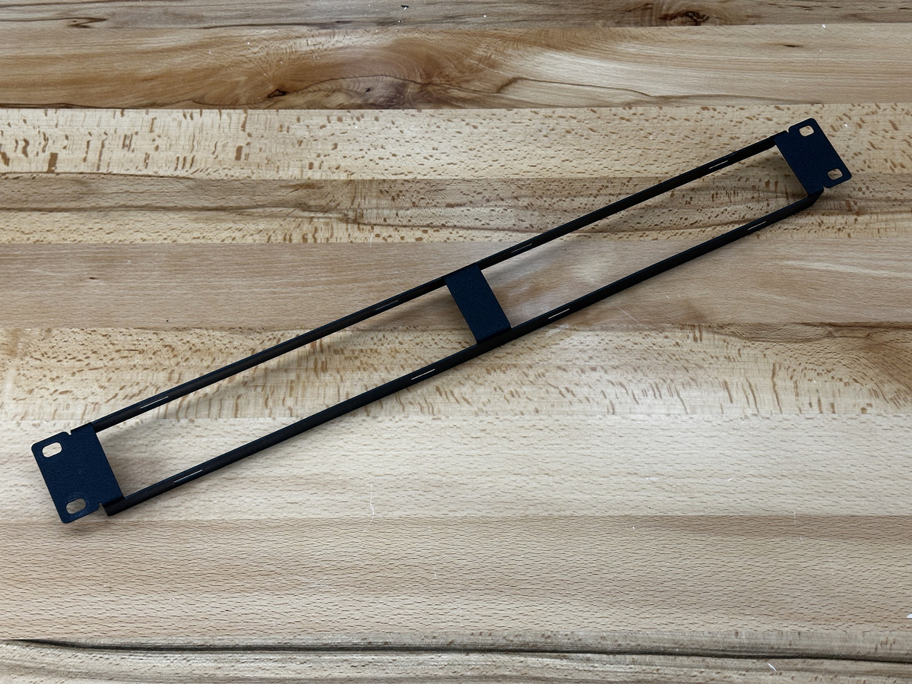
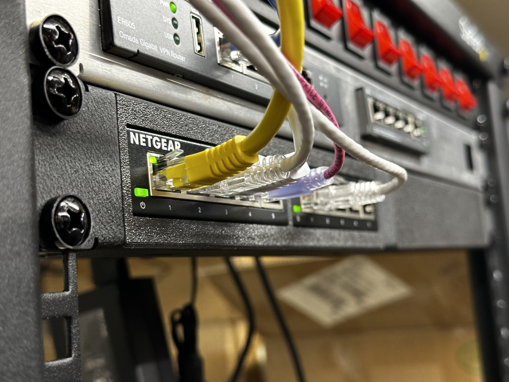
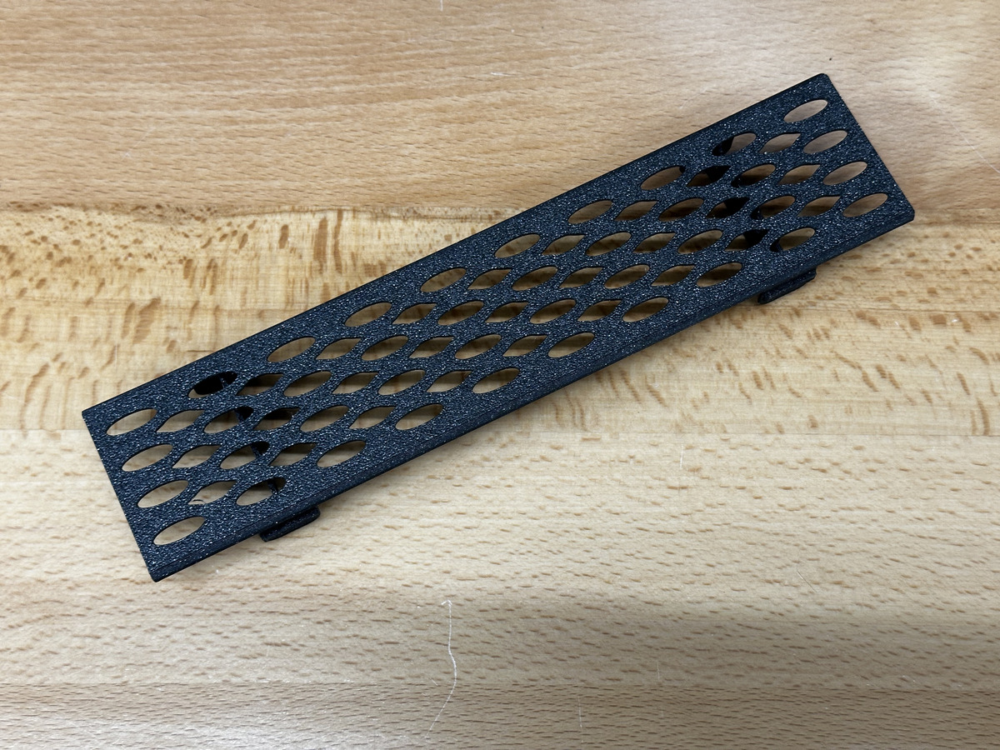
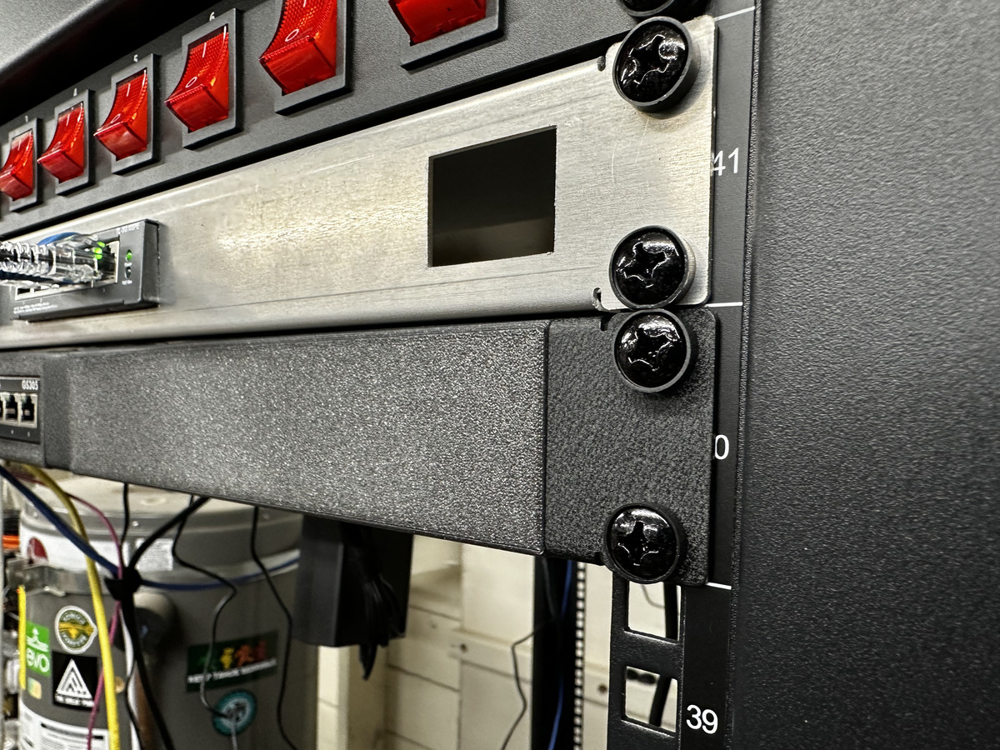

# RackShift

RackShift offers a modular system to mount all of your home lab equipment on a 19" server rack configuration available at 1U height. Start with a sturdy metal server rack frame, which contains two customizable slots for modules to hold assorted electronics and computer equipment that is normally not rack-mountable (such as Pi, cable modem, etc.). Tidy up your home lab with this customizable rackmount kit for your equipment.

Print your own rackmounts, or **[order them on TikTok Shop](https://www.tiktok.com/@getneonship)**. 

From the seller's profile page in the TikTok mobile app, find the Shop link, and browse modules and frames. We are working on selling these through another avenue, but only available through through TikTok for now. 

Order [1U 19" server rack base frame for mounting custom equipment](https://www.tiktok.com/t/ZT8ryrBMJ/)

  

Order [GS305 switches (2) - 200mm module for 1U server rack frame](https://www.tiktok.com/t/ZT8ryDcjo/)

  

Order [Vented blanking panel - 200mm for 1U server rack frame](https://www.tiktok.com/t/ZT8ryuDe5/)

  

Order [Blanking panel - 200mm for 1U server rack frame](https://www.tiktok.com/t/ZT8ryMmyx/)

  

